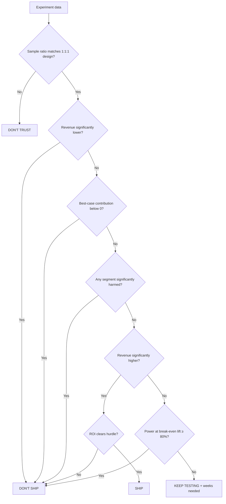

# RetailLab

**Should a retailer keep sending its marketing e-mail?** RetailLab answers that question with a real randomized experiment and a profit-and-loss statement, not a p-value alone.

It takes the [Hillstrom e-mail experiment](https://blog.minethatdata.com/2008/03/minethatdata-e-mail-analytics-and-data.html) (64,000 customers, randomly split into men's e-mail, women's e-mail, and no e-mail), measures how much extra revenue the e-mail caused, prices that lift at a real sector gross margin and a per-send cost, and returns one verdict:

| Verdict | Meaning |
| --- | --- |
| **SHIP** | The lift is real and the campaign clears the ROI hurdle. |
| **DON'T SHIP** | The campaign hurts revenue, loses money, harms a segment, or misses the ROI hurdle. |
| **KEEP TESTING** | The evidence is not decisive yet. The app says how many more weeks to run. |
| **DON'T TRUST** | Arm sizes do not match the designed split, so the data cannot be trusted. |

Every assumption (margin, cost per e-mail, ROI hurdle, CUPED on/off) sits in the sidebar, and every number traces back to one DuckDB star schema.

## Headline result

Using the Damodaran Apparel gross margin (about 57%, January 2026) and $0.18 per e-mail:

- **Ship the e-mail program.** Revenue per customer rose **91%**, against a break-even lift of **48%**. The campaign made about **$6.8k** in contribution (95% interval **$1.5k to $11.7k**), with a **1%** chance of losing money.
- **The men's e-mail carries it.** ROI was **+143%** for the men's e-mail and **+34%** for the women's, which still has a **21%** chance of losing money. The men's e-mail wins head to head after Benjamini–Hochberg correction (p = 0.03).
- **Attributed revenue is not incremental revenue.** **52%** of the revenue from e-mailed customers would have happened without the e-mail.
- **Margin decides the answer.** The same lift clearly pays at apparel margins and is uncertain at grocery or restaurant margins.
- **CUPED is not free.** Past-year spend barely correlates with two-week spend (ρ = 0.02), so it removes only 0.05% of variance here.
- **Peeking is expensive.** Checking an A/A test ten times produces a false winner about 20% of the time.

## How the verdict is reached

Rules run in a fixed order, so trust problems always come before economics and economics before statistical evidence:



The logic lives in [`src/retaillab/decision.py`](src/retaillab/decision.py) and is fully unit-tested.

## What's in the app

The Streamlit app has eleven pages. The decision pages all read one cached readout, so the numbers never disagree between pages.

| Page | Question | Method |
| --- | --- | --- |
| **Overview** | Should we ship? | SRM check, Welch test on revenue per customer, bootstrap contribution interval, power at break-even |
| **Campaign ROI** | Did the campaign pay for itself? | Incremental revenue → gross profit → e-mail cost → contribution |
| **Attributed vs incremental** | How much revenue did the e-mail cause? | Splits attributed revenue into the control-predicted baseline and the causal lift |
| **Who to send to** | Which customers next? | Segment-level lift with BH correction, ranked by contribution per send, filled to a send budget |
| **Which e-mail** | Men's or women's creative? | Three-arm pairwise Welch tests with BH correction |
| **Same lift, different economics** | Would it pay in another sector? | Break-even lift per Damodaran sector against the observed 95% interval |
| **Test planning** | How long should the next test run? | Sample size and weeks for the break-even lift, with and without CUPED |
| **Pitfalls lab** | What can fool the team? | Peeking simulation, a simulated logging bug caught by SRM, placebo segment slicing |
| **Data model** | Where do the numbers come from? | The DuckDB star schema behind every page |
| **Research** | What is this built on? | Papers behind each method |
| **Case study** | What's the story? | The end-to-end write-up |

## Quick start

Requires Python 3.11+.

```bash
git clone https://github.com/advaithvemurisai/retail-ab-lab.git
cd retail-ab-lab
python -m venv .venv && source .venv/bin/activate
pip install -r requirements.txt

python scripts/get_data.py          # downloads Hillstrom CSV and Damodaran margin.xls into data/raw/
python scripts/build_warehouse.py   # optional: writes data/retaillab.duckdb
streamlit run app/streamlit_app.py
```

**No data? It still runs.** Without `data/raw/`, the app switches to synthetic data shaped like Hillstrom with clearly labelled placeholder margins, and says so in the sidebar. Set `RETAILLAB_DEMO=1` to force demo mode.

### Tests

```bash
ruff check .
pytest
```

The suite covers the estimators, the verdict rules (including each past regression), the warehouse, and a render test for every page. The UI tests run in demo mode so CI is deterministic. CI runs lint and tests on every push via GitHub Actions.

## Project layout

```
src/retaillab/
  data.py         load Hillstrom or demo data
  validity.py     sample ratio mismatch, covariate balance
  estimate.py     Welch tests, bootstrap, segment effects
  variance.py     CUPED
  power.py        power and sample size
  finance.py      margins, break-even lift, P&L, contribution distribution
  decision.py     verdict rules
  analysis.py     analyze(): one readout from one set of assumptions
  warehouse.py    builds the DuckDB warehouse
sql/warehouse.sql dim_customer, dim_campaign, dim_sector_finance, fact_exposure, fact_sales,
                  mart_experiment, mart_pnl
app/              Streamlit multipage app
notebooks/        warehouse, e-mail ROI, creative comparison, sector economics
scripts/          data download and warehouse build
tests/            unit tests and page render tests
```

## Data

- **Hillstrom MineThatData E-Mail Challenge (2008).** 64,000 customers randomized in equal thirds, with two-week visit, conversion, and spend outcomes. Credit: Kevin Hillstrom.
- **Damodaran Margins by Sector (NYU Stern).** Gross margins for Apparel, Grocery, and Restaurant/Dining, read directly from the workbook. No margin is hard-coded.

Raw files are downloaded at runtime and are not committed, because Hillstrom states no redistribution license. See [DATA_SOURCES.md](DATA_SOURCES.md) for details and datasets that were considered and rejected.

## Limitations

- The cost per e-mail ($0.18) is an assumption; change it in the sidebar.
- Damodaran margins are averages for US public companies, not one retailer's books.
- Hillstrom has no timestamps, so the peeking demonstration is a simulation.
- Revenue covers a two-week window and ignores longer-run effects such as unsubscribes.
- Segment rankings use point estimates unless the BH filter is on.

## References

Methods follow published work on CUPED (Deng et al., 2013), sample ratio mismatch (Fabijan et al., 2019), always-valid inference (Johari et al., 2015), the delta method (Deng et al., 2018), and false discovery rate control (Benjamini & Hochberg, 1995). Full list in [REFERENCES.md](REFERENCES.md).
